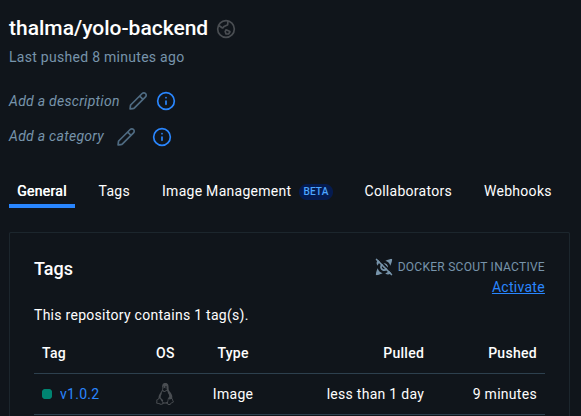

# README

This document provides detailed information and best practices followed during the development and deployment of the microservices-based e-commerce platform using Docker.

---

## Project Description

This project consists of three distinct microservices:
- **Frontend (`yolo-client`)**: React.js application for user interactions.
- **Backend (`yolo-backend`)**: Node.js service handling business logic and API interactions.
- **Database (`app-ip-mongo`)**: MongoDB service for persistent data storage.

---

## Git Workflow
- Each microservice has a dedicated Git branch.
- Descriptive commits clearly document each development step.
- Pull Requests (PR) reviewed and merged after successful testing.

---

## Folder Structure
```
.
├── backend/
│   ├── Dockerfile
│   └── server.js
├── client/
│   ├── Dockerfile
│   └── src/
└── docker-compose.yaml
```

---

## Docker Image Choices

### Frontend (`yolo-client`)
- **Builder**: `node:14-slim` – Chosen for lightweight builds (~165MB).
- **Runtime**: `alpine:3.16.7` – Minimizes container size (~7MB).

### Backend (`yolo-backend`)
- **Builder**: `node:14` – Robust environment for dependency handling (~914MB).
- **Runtime**: `alpine:3.16.7` – Efficient lightweight runtime (~7MB).

### Database (`app-ip-mongo`)
- Official MongoDB image (`mongo:latest`) – Reliable and widely supported (~888MB).

---

## Dockerfile Directives
- Multi-stage builds employed for both frontend and backend for optimized runtime efficiency.
- Explicitly defined `EXPOSE` directives and runtime commands (`CMD`).

---

## Docker Compose Networking
- Single custom bridge network `app-net` ensures efficient inter-service communication.
- Clearly defined port mappings:
  - Frontend: Host `3001` → Container `3000`
  - Backend: Host `5000` → Container `5000`
  - Database: Host `27017` → Container `27017`

---

## Docker Compose Volumes
- `app-mongo-data` ensures MongoDB data persistence across container restarts.

---

## Image Naming and Tagging
- Semantic versioning for easy identification (`v1.0.2`).
- Images tagged and clearly labeled, pushed to Docker Hub.

---

## Running & Debugging
- Launch application with: `docker compose up -d`
- Monitor logs via:
  ```sh
  docker compose logs -f [service_name]
  ```
- End-to-end functionality tested and verified.

---

## Docker Hub Deployment
- Images are available on Docker Hub with clear version tags.
- Screenshot provided clearly displaying Docker Hub image versions.



---

Following the above best practices ensures reliability, maintainability, and ease of collaboration for future development.

