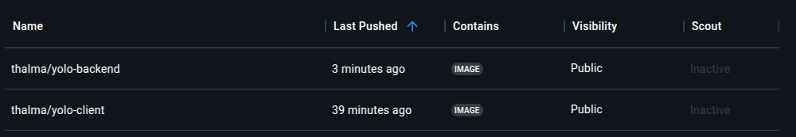
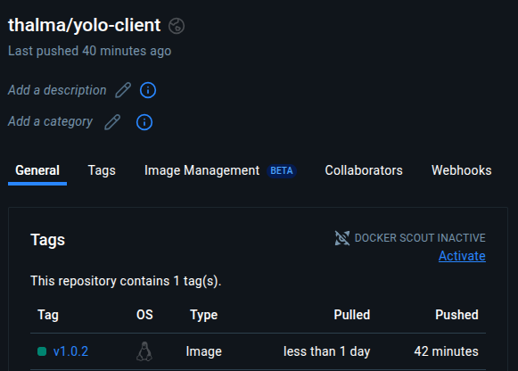

# Explanation of Implementation

This document covers our design and implementation choices across each microservice and project-wide practices:

---

## 1. Frontend Service (`yolo-client`)

### 1.1 Choice of Base Image
- **Builder**: `node:14-slim`
  - Lightweight Node.js environment for faster builds (~165 MB).
- **Runtime**: `alpine:3.16.7`
  - Minimal base image for reduced container size (~7 MB).

### 1.2 Dockerfile Directives
- **Multi-stage build** used to separate dependencies and runtime.
- `npm install` installs dependencies efficiently.
- `EXPOSE` explicitly defines the frontend's listening port (3000).

### 1.3 Docker Compose Networking
- Uses bridge network `app-net`.
- Ports: host `3001` → container `3000`.

### 1.4 Volumes
- No persistent volume required for static frontend.

### 1.5 Git Workflow
- Branch created for frontend Dockerization.
- Commits clearly document each step (Dockerfile setup, dependency management, etc.).

### 1.6 Running & Debugging
- Tested using Docker build and Docker Compose.
- Debugged via container logs (`docker compose logs -f yolo-client`).

### 1.7 Good Practices
- Semantic version tagging (`v1.0.2`) for Docker images.

---

## 2. Backend Service (`yolo-backend`)

### 2.1 Choice of Base Image
- **Builder**: `node:14`
  - Standard Node.js environment, robust and reliable (~914 MB).
- **Runtime**: `alpine:3.16.7`
  - Lightweight for runtime efficiency (~7 MB).

### 2.2 Dockerfile Directives
- Multi-stage build keeps runtime clean.
- Uses `apk` for minimal Node.js installation on Alpine.
- `CMD` to run backend server with Node.js directly.

### 2.3 Docker Compose Networking
- Uses bridge network `app-net`.
- Environment variable for MongoDB connection (`MONGODB_URI`).
- Ports: host `5000` → container `5000`.

### 2.4 Volumes
- No direct volumes, data stored in MongoDB container.

### 2.5 Git Workflow
- Separate backend Dockerization branch.
- Clear commit messages for each significant update.

### 2.6 Running & Debugging
- Used container logs and network tests (`docker compose logs -f yolo-backend`).
- Validated database connectivity.

### 2.7 Good Practices
- Consistent Docker image tagging (`v1.0.2`).
- Clear environment configurations.

---

## 3. Database Service (`app-ip-mongo`)

### 3.1 Choice of Base Image
- Official MongoDB image (`mongo:latest`), widely supported and stable (~888 MB).

### 3.2 Dockerfile Directives
- Uses official image directly, ensuring default configurations.

### 3.3 Docker Compose Networking
- Connected via bridge network `app-net`.
- Ports: host `27017` → container `27017`.

### 3.4 Docker Compose Volumes
- Defined volume `app-mongo-data` ensures persistent database storage.

### 3.5 Git Workflow
- Database setup documented clearly in README.

### 3.6 Running & Debugging
- Connectivity checks from backend to Mongo container.
- Persistent data verification after restarts.

### 3.7 Good Practices
- Clear naming convention for volumes and services.

---

## 4. Project-Wide Practices

### 4.1 Docker Compose Networking & Volumes
- Single network (`app-net`) simplifies inter-service communication.
- Volume definitions for MongoDB persistence.

### 4.2 Git Workflow Summary
- Each service has dedicated branches and descriptive commits.
- Merged through pull requests with reviews.

### 4.3 Running & Debugging End-to-End
- `docker compose up -d` ensures straightforward application launch.
- End-to-end testing verifies full functionality and persistence.

### 4.4 Image Tagging & Docker Hub
- Consistent semantic version tagging (`v1.0.2`).
- Images pushed to Docker Hub, with version clearly displayed.

---

With these structured choices, the project can reliably be cloned, built, and run using Docker Compose, providing a fully functional microservices-based e-commerce platform.

